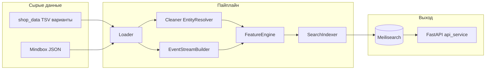

# Архитектура

Этот документ — **обзор системы**: поток данных, какие модули за что отвечают, как устроены API и фильтры витрин.

**Нормативная детализация** (этапы, все формулы, краевые случаи, поля индекса дословно под код):  
[PIPELINE_AND_SCORING_REFERENCE.md](PIPELINE_AND_SCORING_REFERENCE.md)

---

## 1. Поток данных (логический)

Смысл: **один документ в индексе = один `product_id`**. События сначала поднимаются с уровня варианта до товара, затем суммируются в окне дат, затем считается score.

---

## 2. Этапы оркестратора и файлы

| Этап | Файл(ы) | Выход (типично) |
|------|---------|------------------|
| 0 Аудит | `pipeline/audit.py` | `artifacts/raw_audit_report.json` |
| 1 Загрузка | `pipeline/loader/raw_data_loader.py` | объекты в памяти |
| 2 Очистка | `pipeline/cleaner/entity_resolver.py`, `cleaner.py` | `artifacts/cleaned_catalog.csv` |
| 3 События | `pipeline/loader/event_stream.py` | `artifacts/event_product_daily.csv` |
| 3 Скоринг | `pipeline/feature_engine/engine.py` | колонки score в каталоге → `artifacts/scored_catalog.csv` |
| 4 Индекс | `pipeline/search_indexer/indexer.py` | индекс(ы) Meilisearch |

Точка входа CLI: `src/run_pipeline.py` → `pipeline/orchestrator.py`.

---

## 3. Модули: зона ответственности

| Модуль | Задача |
|--------|--------|
| `pipeline/config.py` | Корень проекта, `raw_data_dir`, пути к TSV/JSON, артефактам, Meilisearch по умолчанию. |
| `pipeline/audit.py` | Обзор сырья без полного тяжёлого чтения (лимиты выборки). |
| `pipeline/loader/raw_data_loader.py` | Чтение каталога и списка JSON-файлов событий. |
| `pipeline/loader/event_stream.py` | Разбор действий, интенты, `aggregate_daily_products` (день × товар). |
| `pipeline/cleaner/entity_resolver.py` | TSV → нормализованные поля, **группировка по `ID товара`**, штрих-коды, категория из путей сайта. |
| `pipeline/cleaner/cleaner.py` | Поля `is_sale`, остатки, фильтр «активных кандидатов», типы. |
| `pipeline/feature_engine/engine.py` | Окно дат, агрегация метрик по товару, **все формулы скоринга**. |
| `pipeline/search_indexer/indexer.py` | Подготовка документов, настройки индекса, `add_documents`. |
| `pipeline/meilisearch_strategy_indexes.py` | Имена индексов `kixbox_products_{strategy}`, override. |
| `src/api_service.py` | FastAPI: health, метаданные UI, продуктовые эндпоинты → поиск в Meilisearch. |
| `src/index_all_strategy_indexes.py` | Заливка нескольких CSV стратегий в отдельные индексы. |
| `src/analyze_score_variants.py` | Офлайн-сравнение стратегий, отчёты в `artifacts/`. |

---

## 4. Связь вариант ↔ товар ↔ событие

1. В каталоге на каждой строке варианта есть **`Штрих-код`** и **`ID товара`**.
2. В Mindbox в событии часто приходит **`insalesId`** (вариант).
3. Оркестратор строит словарь **штрих-код → `product_id`** и передаёт его в агрегатор событий, чтобы дневные счётчики были на **`product_id`**.

Подробности и ограничения — в справочнике, раздел про entity resolution и zero leakage.

---

## 5. Meilisearch

- **Документ:** плоская структура полей из `SearchIndexer.prepare_documents` (список полей — в справочнике, часть F).
- **Primary key:** `id` (= `product_id`).
- **Несколько индексов:** при мульти-стратегии UID вида `{MEILISEARCH_INDEX_BASE}_{baseline|funnel|robust|commercial}`; параметр **`strategy`** в API выбирает, в какой индекс идёт запрос (см. `_strategy_and_uid` в `api_service.py`).
- **Ранжирование в поиске:** в настройках индекса в `rankingRules` участвует правило **`final_score:desc`** (после стандартных правил Meilisearch).

---

## 6. API: эндпоинты и фильтры

Базовый модуль: `src/api_service.py`, класс с методами поиска и обёртка FastAPI.

### 6.1. Система и UI

| Метод | Путь | Назначение |
|--------|------|------------|
| GET | `/health` | Meilisearch + диагностика шаблона `ranking_lab.html`. |
| GET | `/` | HTML лаборатории ранжирования. |
| GET | `/debug/ui-info` | Путь к шаблону, наличие `select#strategy`. |
| GET | `/app/meta` | Метаданные для UI (категории, бренды, окно скоринга из env и т.д.). |

### 6.2. Товары (Meilisearch)

Все запросы ниже поддерживают query-параметр **`strategy`** (`baseline` | `funnel` | `robust` | `commercial`), если заданы отдельные индексы.

| Метод | Путь | Фильтр Meilisearch | Сортировка |
|--------|------|---------------------|------------|
| GET | `/products/trending` | нет | `final_score:desc` |
| GET | `/products/new` | `is_new = true AND in_stock = true AND current_on_site = true` | `final_score:desc` |
| GET | `/products/sale` | `is_sale = true AND in_stock = true AND current_on_site = true` | `final_score:desc` |
| GET | `/products/page/{page_tag}` | `in_stock` и `current_on_site` + см. таблицу тегов ниже | `sort_by` → см. `_resolve_sort` |
| POST | `/products/search` | как у `get_page`, плюс поля из тела `SearchRequest` | из запроса |

**Замечание:** в docstring у `get_new_arrivals` упоминается сортировка по новизне; **фактически в коде** используется **`final_score:desc`** (как у sale). Для поведения «сначала novelty» нужна отдельная правка кода или клиентская сортировка.

### 6.3. Значения `page_tag` для `/products/page/{page_tag}`

К `in_stock = true AND current_on_site = true` добавляется:

| `page_tag` | Дополнительное условие |
|------------|-------------------------|
| `new_arrivals` | `is_new = true` |
| `sale` | `is_sale = true` |
| `men` | `gender = 'male'` |
| `jackets` | `category_name` ∈ `Куртки`, `Куртка`, `Пуховики`, `Жилеты` (через `OR`) |

Любой другой `page_tag` → только витрина + наличие (без доп. клаузы из `_page_filter_clauses`).

### 6.4. POST `/products/search`

Строит фильтр через `_build_filter`: те же флаги, плюс опционально `brand`, `category` (имя категории), `gender`, `is_new`, `is_sale`, `min_price`, `max_price`, `page_tag`. Текст запроса — поле `q` (полнотекстовый поиск Meilisearch).

### 6.5. Сортировка (`sort_by`)

Алиасы → выражения Meilisearch: `final_score`, `popularity`, `novelty`, `price_desc`, `price_asc`, `price` (как `price:desc`). Неизвестное значение → `final_score:desc`.

---

## 7. Справочник `categories.csv`

Файл попадает в бандл загрузки, но **не участвует** в сборке `category_name` в `EntityResolver` (категория берётся из колонки размещения на сайте). Это важно при анализе расхождений с бизнес-справочником категорий.

---

## 8. Связанные документы

| Документ | Когда открывать |
|----------|------------------|
| [PIPELINE_AND_SCORING_REFERENCE.md](PIPELINE_AND_SCORING_REFERENCE.md) | Нужна полная спецификация под код. |
| [PIPELINE.md](PIPELINE.md) | Команды запуска и таблица env. |
| [SCORING.md](SCORING.md) | Выбор стратегии, бусты, окно vs half-life с точки зрения продукта. |
| [DATA.md](DATA.md) | Что не коммитим в Git. |
