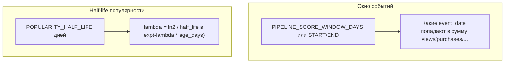

# Скоринг: стратегии, формулы, бусты, окно и half-life

Краткий **продуктово-инженерный** слой: как устроен score, чем стратегии отличаются, какие ручки крутить через env.

**Единый нормативный документ** (все формулы, порядок `age_days`, краевые случаи, список полей индекса):  
[PIPELINE_AND_SCORING_REFERENCE.md](PIPELINE_AND_SCORING_REFERENCE.md)

---

## 1. Цепочка расчёта (одна строка товара)

Порядок в `FeatureEngine.compute_scores`:

1. Агрегировать события по `**product_id`** в рамках **окна дат** → `views`, `purchases`, корзина, выручка, уникальные и т.д.
2. Посчитать `**total_purchases`** = сумма `purchases` по всем товарам после окна (для новизны).
3. Вычислить `**age_days**`, обновить `**is_new**` (порог 365 дней).
4. Для каждой строки: `**popularity**` → `**novelty**` → `**boost**` → `**final_score**`.

Стратегия влияет только на то, как из сырых метрик собирается `**popularity**` (через `base_score`). **Новизна** от стратегии не зависит.

---

## 2. Итоговая формула

```text
final_score = log1p(popularity) × (novelty × NOVELTY_WEIGHT / 14) × boost
```

- `log1p` — натуральный логарифм.
- Делитель **14** — константа `novelty_divisor` в коде.
- Если `**popularity ≤ 0`** и `**novelty == 0**` → `**final_score = 0**`.

---

## 3. Популярность

```text
popularity = base_score × exp(−λ × age_days)
```

- `**λ = ln(2) / POPULARITY_HALF_LIFE**`, env `**POPULARITY_HALF_LIFE**`, по умолчанию **30** дней.
- Это **не** окно событий: half-life отвечает на вопрос «насколько быстро „остывает“ карточка по возрасту», а окно — «какие дни событий суммируем».

### 3.1. Промежуточные величины (все стратегии)

- `**views_signal`** = `max(views,0)` или `**ln(1+views)**` в зависимости от флага стратегии.
- `**net_cart**` = `max(cart_adds − cart_removes, 0)`.

### 3.2. Таблица `base_score` по стратегиям (как в коде)

Код стратегии задаётся `**PIPELINE_SCORE_STRATEGY**` (и дублируется в `SCORE_STRATEGIES` в `engine.py`).


| Стратегия      | `base_score`                                                                             |
| -------------- | ---------------------------------------------------------------------------------------- |
| **baseline**   | `0.3 × max(views,0) + 0.7 × purchases`                                                   |
| **funnel**     | `0.2 × ln(1+views) + 0.3 × net_cart + 0.5 × purchases`                                   |
| **robust**     | `0.15×unique_viewers + 0.30×unique_cart_customers + 0.35×unique_buyers + 0.20×purchases` |
| **commercial** | `0.15 × ln(1+views) + 0.4×purchases + 0.2×units_purchased + 0.4×ln(1+max(revenue,0))`    |


В ветках **baseline / funnel** формула в коде записана через `views_signal` и `net_cart × cart_weight`; у baseline `**cart_weight = 0`**, у robust `**views_signal` в сумме не используется**.

### 3.3. Когда какую стратегию иметь в виду


| Стратегия      | Интуиция                                                                  |
| -------------- | ------------------------------------------------------------------------- |
| **baseline**   | Классика: просмотры и покупки в фиксированной пропорции, без корзины.     |
| **funnel**     | Сильнее покупки и «чистая корзина», просмотры сглажены логарифмом.        |
| **robust**     | Меньше шума от одного гиперактивного клиента — счётчики уникальных людей. |
| **commercial** | Упор на деньги и объём заказа, просмотры только с малым весом.            |


Несколько стратегий в проде обычно означает **несколько индексов** и параметр `**strategy`** в API.

---

## 4. Новизна

```text
novelty = −log2((purchases + 1) / (total_purchases + 1))
```

- Логарифм по основанию **2**.
- Если `**total_purchases ≤ 0`** → `**novelty = 1**` для всех (ветка в `calculate_novelty`).

`total_purchases` — сумма покупок **по всем товарам в выбранном окне событий**, не «глобально за всё время», если окно сужено.

---

## 5. Буст (мультипликативно)

Старт **1.0**, затем перемножаются применимые множители:


| Смысл           | Env                  | Дефолт                                                                           |
| --------------- | -------------------- | -------------------------------------------------------------------------------- |
| В наличии       | `BOOST_IN_STOCK`     | 1.5                                                                              |
| Нет в наличии   | `BOOST_OUT_OF_STOCK` | 0.05                                                                             |
| Ручной featured | `BOOST_FEATURED`     | 1.3 (нужны `is_featured` / `featured`)                                           |
| Акция           | `BOOST_SALE`         | 1.2                                                                              |
| Категория       | `BOOST_CATEGORY_MAP` | JSON, ключ = `category_name` lower; иначе **×1**                                 |
| Сезон           | —                    | Только если `**PIPELINE_ENABLE_SEASONALITY`**: в сезоне **×1.15**, вне **×0.90** |


Порядок применения в коде: наличие → featured → sale → категория → сезонность.

---

## 6. Два разных «окна» — не путать




- **Окно** управляет **поведенческими** числителями.
- **Half-life** управляет **затуханием** уже собранного `base_score` от **возраста карточки** (`age_days`), который считается **отдельно** от окна (см. справочник, раздел про `age_days`).

Пример: окно **30 дней** событий и half-life **30 дней** — частые настройки, но это **два независимых** параметра.

---

## 7. Воспроизводимость

Одинаковые исходные CSV недостаточны. Нужны одинаковые: **коммит**, **полный набор env** (включая `BOOST_*`, `POPULARITY_HALF_LIFE`, лимиты `PIPELINE_*`), **as_of_date**, **окно**, **стратегия**, и при сравнении выдачи — **один и тот же индекс или один и тот же `scored_catalog_*.csv`**.

---

## 8. См. также

- [PIPELINE.md](PIPELINE.md) — команды и таблица переменных окружения.
- [ARCHITECTURE.md](ARCHITECTURE.md) — модули, API, фильтры витрин.

